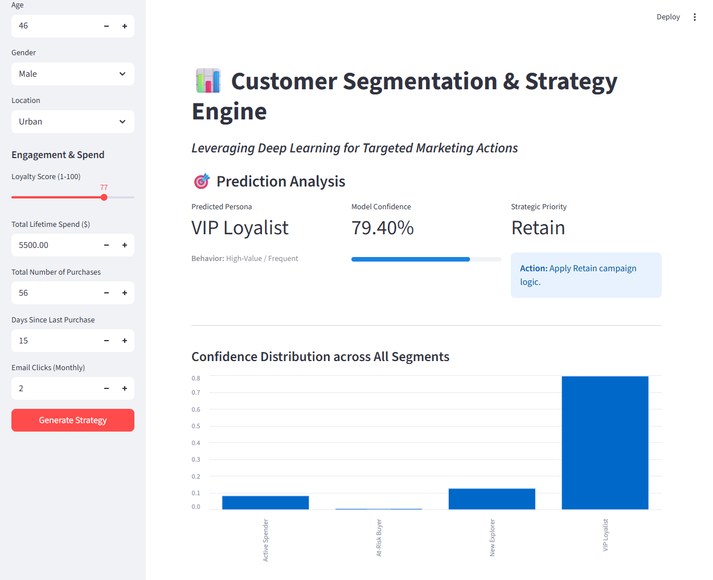

# Customer Segmentation & Predictive Analytics

An end-to-end Machine Learning pipeline that combines **Unsupervised Clustering** with **Deep Supervised Learning** to automate customer persona identification and marketing strategy generation.

## 📊 Project Performance

Based on the execution for the customer behavioral dataset:

- **Optimal Clustering:** Identified **4 distinct customer segments** using K-Means++ and the Elbow Method.

- **Best Validation Accuracy:** **92.50%** achieved during the training of the multi-class classifier.

- **Convergence:** The model reached its peak performance within 40 epochs, successfully learning to map demographic data to behavioral clusters.



## 🛠️ Step-by-Step Methodology

### 1. Step 1 (Clustering Objective)

The objective was to discover latent customer personas by grounding the analysis in objective behavioral metrics—specifically spending habits, purchase frequency, and loyalty engagement.

### 2. Step 2 (Unsupervised Learning)

- **Feature Selection:** Utilized `TotalSpent`, `NumPurchases`, `AvgOrderValue`, `LastPurchaseDays`, `EmailClicks`, and `LoyaltyScore` for segmentation.

- **Normalization:** Applied `StandardScaler` to ensure behavioral distance metrics were not biased by feature scales.
- **Success Criteria:** Saved the generated labels to `segmented_customers.csv` for downstream supervised tasks.

### 3. Step 3 (Deep Learning Architecture)

The architecture utilizes a **Multi-Layer Perceptron (MLP)**:

- **Input Layer:** Processes **7 engineered features** (including Age, Location, and Value Density).

- **Hidden Layers:** Implements dense layers with **Batch Normalization** and **Dropout** to prevent overfitting on small demographic datasets.
- **Classification Head:** Maps features to one of the **4 discovered segments** using a Softmax output.

### 4. Step 4 (Feature Engineering)

- **Interaction Features:** Engineered **Value Density** (Spend/Purchases) and **Engagement Index** to boost predictive precision.
- **Temporal Context:** Implemented an **IsActive** flag based on purchase recency to distinguish between loyalists and at-risk buyers.

### 5. Step 5 (Model Evaluation)

- **Validation Strategy:** Employed a stratified 80/20 split to ensure segment representation across training and testing sets.
- **Loss Function:** Used `CrossEntropyLoss` to optimize for multi-class segment prediction.

### 6. Step 6 (Interactive Deployment)

Created a **Streamlit Dashboard** that provides:

- **Real-Time Profiling:** Instant persona classification for new customers.
- **Strategic Actions:** Automated marketing recommendations (e.g., _Upsell_, _Retain_, _Nurture_, _Re-engage_).

## 📂 File Structure

- `data/`: Contains raw and `segmented_customers.csv` datasets.

- `segmenter.py`: K-Means++ logic and persona profiling.

- `data_processor.py`: Advanced feature engineering and tensor preparation.

- `model.py`: PyTorch Deep Neural Network definition.
- `main.py`: Pipeline orchestrator for training and validation.

- `app.py`: Interactive Streamlit strategy dashboard.

## 🚀 Getting Started

1. **Install Dependencies:**

```bash
pip install -r requirements.txt

```

2. **Run the Training Pipeline:**

```bash
python main.py

```

3. **Launch the Dashboard:**

```bash
streamlit run app.py

```

## 💡 Business Insights

- **VIP Loyalty:** Segment 1 represents your highest value assets ($4,025 avg spend), requiring high-touch retention.

- **Recency Alert:** Segment 3 shows a high average of 323 days since the last purchase, signaling a critical need for re-engagement campaigns despite high email activity.
